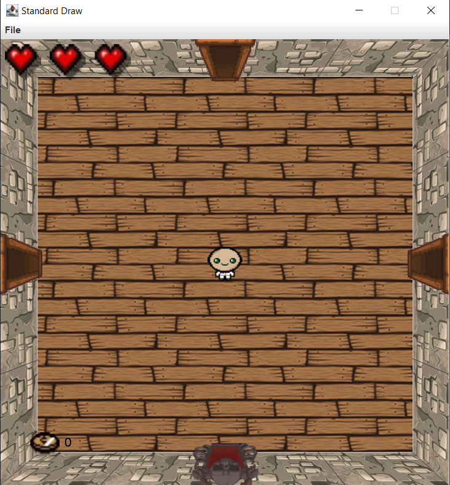
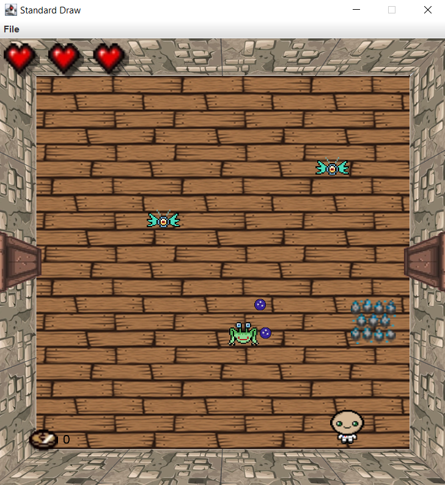
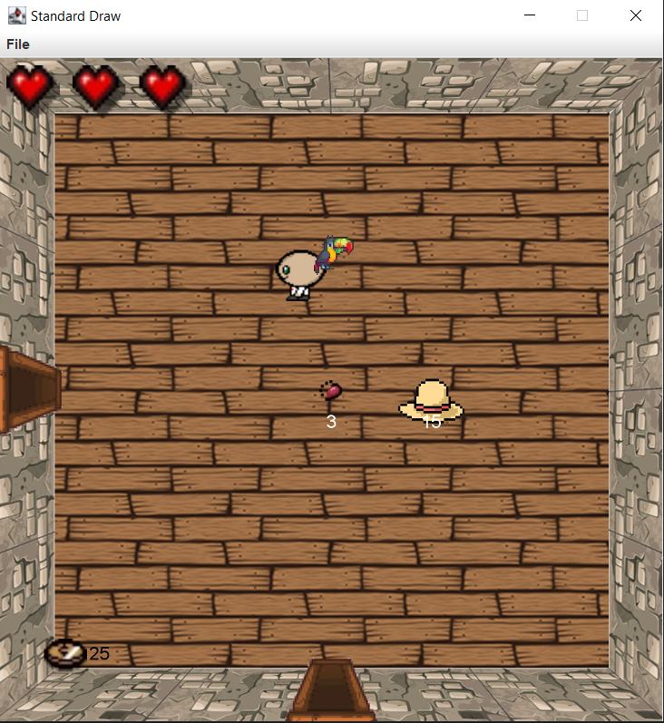
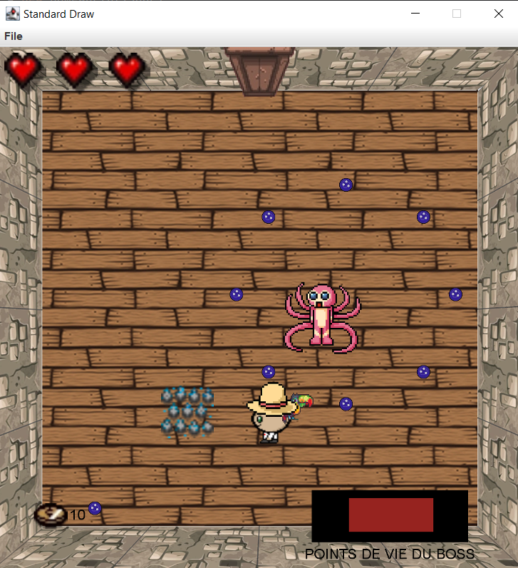

# README
#### Author : Louis PERON && [Noë MERCIER-BROSSE](https://github.com/NMercierBr)

# isaaceGameLike
*2D game coded in Java with the assistance of StdDraw (Java Game Library)*

## Goal
The goal with this project was to explore the world of video game programming and enhance our dev skills.
## Preview

Some pictures of the game :

1. Spawn room
   
2. Mobs room
   
3. Items shop room
   
4. Final boss room
   

## How to install the project

To make this project work on your preferred IDE, you will just need to pull the project and run the main.

## Structure

Class set for game objects, class set for the world (setup the different rooms) and library for maths functions and some stuff like that.
Also resources directory for the in-game metrics.